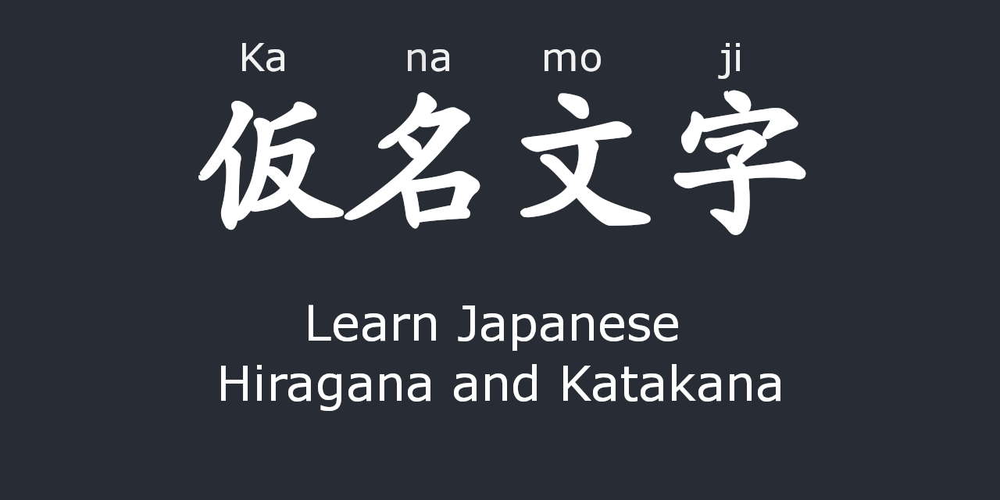
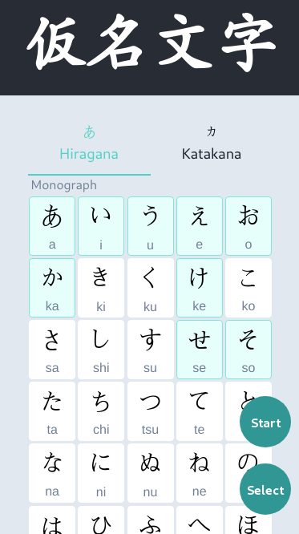
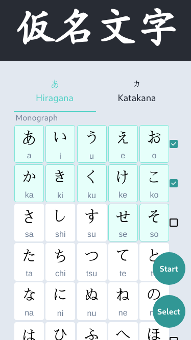
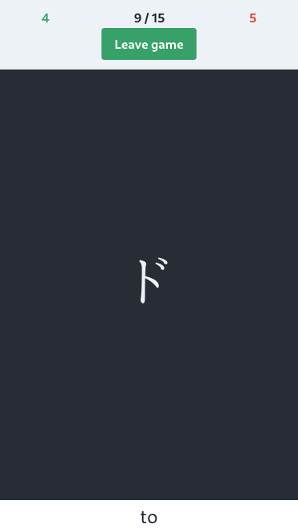
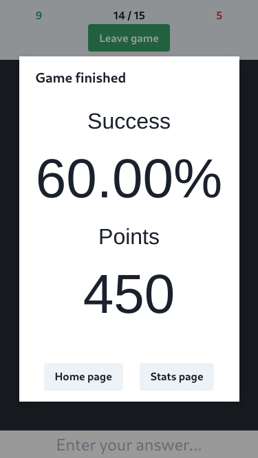
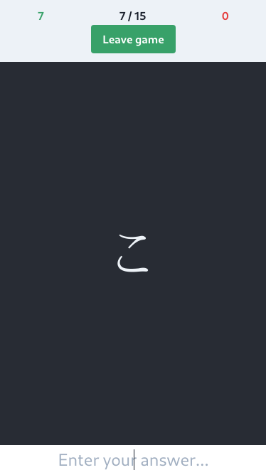

# 仮名文字 (Kanamoji)
WIP. Learn Japanese kana by repetition.

Clicking on a kana category will select/unselect everything under that category (Monograph or Dakuten).

Data is stored in the browser local storage.

Currently working on the stats page in my free time.

## Screenshots
### Home page

### Game page

**Do not use the project structure as reference, there is a lot to be improved and optimized**

I am currently not working on this, but I'm planning to rewrite everything using React Native once I finish some projects I am currently working on
